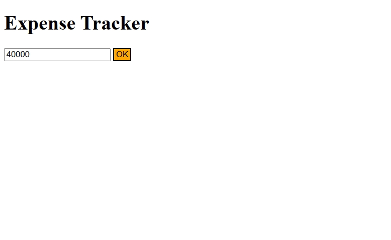
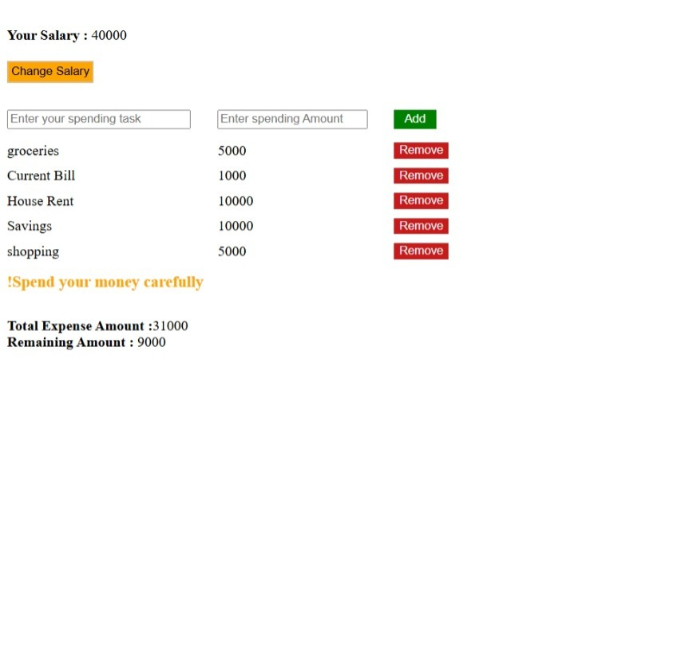

# Expense-Tracker-Web-App
A simple Expense Tracker web application built using HTML, CSS, and JavaScript. It helps users track expenses, calculate remaining balance, and store data using localStorage.
 ## Features

 - Add & remove expenses
 - Remaining balance calculation
 - Expense validation
 - Warning messages for overspending
 - localStorage for data persistence
 - Dynamic DOM rendering
 - Modular JavaScript structure using import/export

 ## Screenshots

 ### Home Page
 

 ### Expenses Track
 